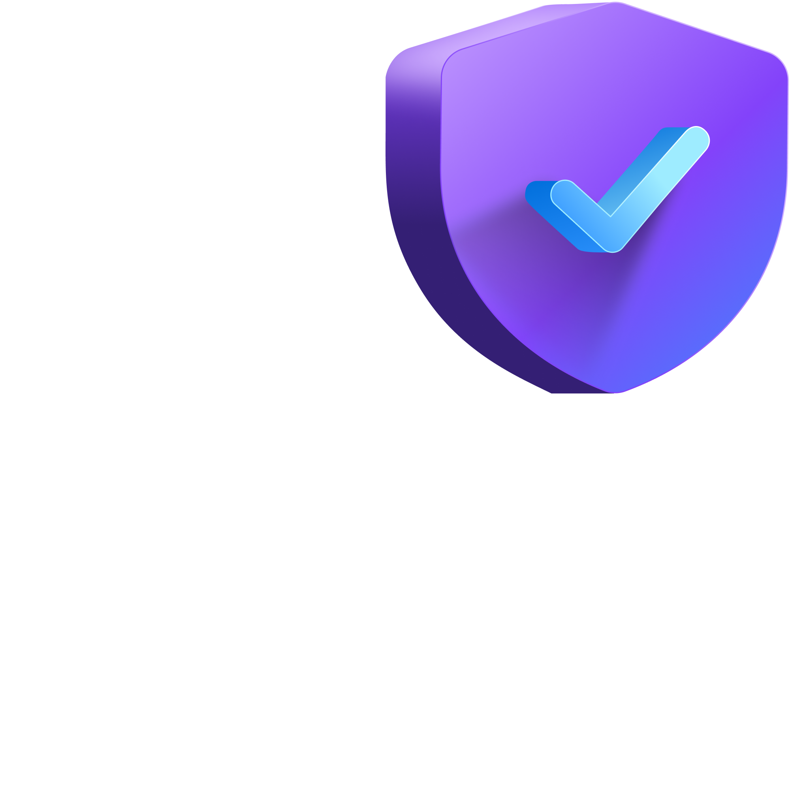

# GitHub Advanced Security Training Repository

Welcome to the GitHub Advanced Security (GHAS) training repository. This repository is part of a training where your instructor guides you through a series of hands-on exercises.

There are three tracks, and you follow one track per training:

1. **Supply Chain Security**  
2. **Secret Protection**  
3. **Code Security**

---

### Tracks Overview

| Supply Chain Security | Secret Protection | Code Security |
|---|---|---|
|  |  |  |

---

Start your journey by selecting the track you are following today above!
