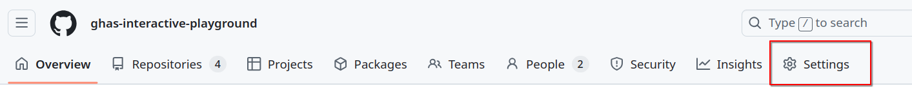
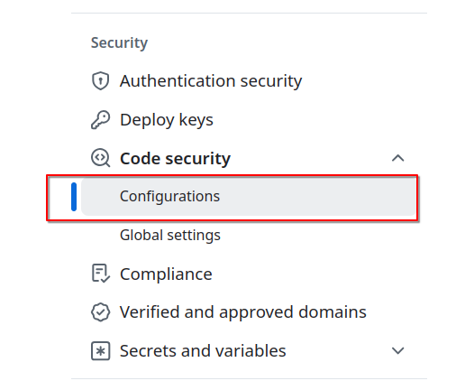
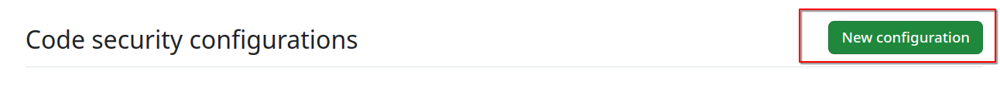

# GHAS Labs

## Enablement Settings 

**TO DO: FINISH THIS AFTER DEC 10 WHEN ENTERPRISE CONFIGS HAVE SHIPPED**

GitHub security configurations provide a way to manage and enforce security settings across repositories in your organization, enabling consistent 
application of security best practices. Organizations can choose from two options based on their needs:
- GitHub-recommended security configurations
- custom security configurations.

### Lab - Setting Up a Custom Security Configuration and Enabling Dependency Graph

(Instructor notes: Mention how we recommend securing your organization with the GitHub-recommended security configuration, then evaluating the security findings on your repositories
before configuring custom security configurations. However, for learning experience we will set up our own security configuration. )

In this lab, you will learn how to create and apply a custom security configuration to repositories in your organization. Follow the steps below to complete the exercise:

1. Click on your Organisation's settings

2. In the "Security" section of the sidebar, select the Code security dropdown menu, then click Configurations.

3. In the "Code security configurations" section, click New configuration.

4. To help identify your custom security configuration and clarify its purpose on the "Code security configurations" page, name your configuration and create a description. 

5. For each configuration option select the following:
 - `GitHub Advanced Security Features`: Select `Include`.
 - `Dependency Graph`: Select `Enabled`.
 - All Other Settings: Select `Not set`.
Policies:
 - For `Use as default for newly created repositories`, select `All repositories`.
 - For `Enforce Configuration`, select `Enforce`.

