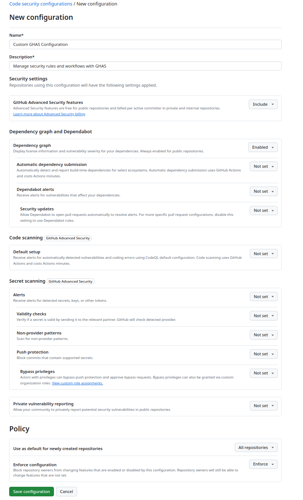
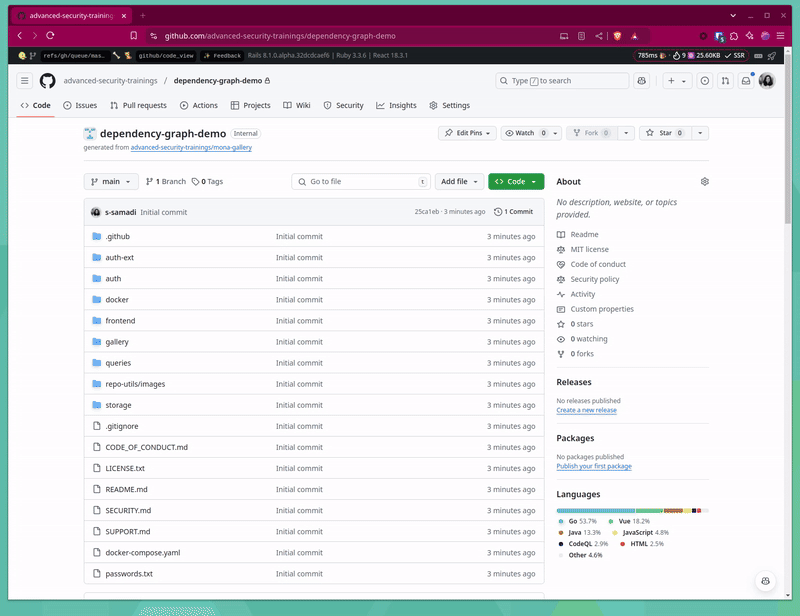

# GHAS Labs

## Enablement Settings 

**TO DO: FINISH THIS WHEN ENTERPRISE CONFIGS HAVE SHIPPED**

GitHub security configurations provide a way to manage and enforce security settings across repositories in your organization, enabling consistent 
application of security best practices. Organizations can choose from two options based on their needs:
- GitHub-recommended security configurations
- custom security configurations.

### Lab - Setting Up a Custom Security Configuration and Enabling Dependency Graph

(Instructor notes: Mention how we recommend securing your organization with the GitHub-recommended security configuration, then evaluating the security findings on your repositories
before configuring custom security configurations. However, for learning experience we will set up our own security configuration. )

In this lab, you will learn how to create and apply a custom security configuration to repositories in your organization. Follow the steps below to complete the exercise:

1. Click on your Organisation's settings. In the `Security` section of the sidebar, select the `Code security` dropdown menu, then click `Configurations`.  You will be navigated to the "Code security configurations" page, click `New configuration` button.

2. To help identify your custom security configuration and clarify its purpose on the "Code security configurations" page, name your configuration and create a description. 

3. For each configuration option select the following:
 - `GitHub Advanced Security Features`: Select `Include`.
 - `Dependency Graph`: Select `Enabled`.
 - All Other Settings: Select `Not set`.
Policies:
 - For `Use as default for newly created repositories`, select `All repositories`.
 - For `Enforce Configuration`, select `Enforce`.
 

4. Click on `Save Configuration` button. Please confirm save if prompted.

5. The page will redirected to the `Configurations` page. Click on the `Apply to` dropdown and select `All repositories`. There will be a prompt for confirmation, select `Apply`.

**TO DO: GIF THIS WHEN TOTAL NUMBER OF REPOS CONFIRMED**

### Lab - Dependency Graph

(Instructor notes: Go through dependency graph slides) 

1. Navigate to the Dependency Graph at the repository level. On the repository page, locate the `Insights` tab in the navigation bar at the top. Under the `Insights` sections, find and click on `Dependency Graph` from the left-hand menu. 
2. Carefully review the list of dependencies displayed and verify completeness. Look for any missing dependencies.

1. Navigate to Dependencies at the Organisation level. On the Organization page, locate the `Insights` tab in the navigation bar at the top. Under the `Insights` sections, find and click on `Dependencies` from the left-hand menu. 
2. Review the licences used in the organisation.
3. Explore the relationship between dependencies and dependents.

### Lab - Dependency Submission API 

