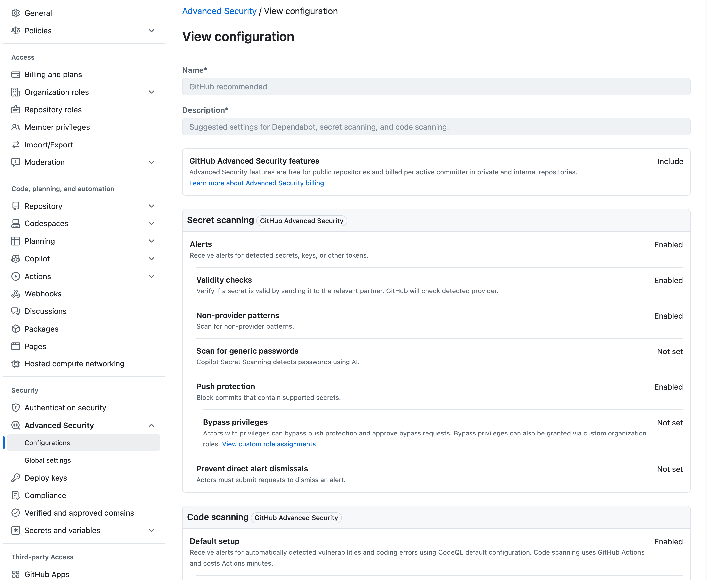
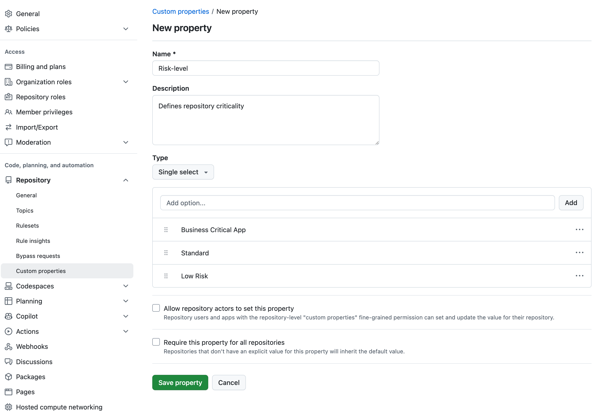

# Module 0 - GitHub Advanced Security: Organization-Level Setup

## Labs Overview
In this module, you’ll perform the initial setup of GitHub Advanced Security (GHAS) at the organization level by:
1. Reviewing predefined security configurations.
2. Creating a custom property for categorizing repositories.
3. Creating a custom security configuration for your track.
4. Creating an enforced policy for `Business Critical Apps` high-risk repositories.

---

### Lab 1 - Introduction to Security Configurations
#### Objective
Understand what organization‑level Security Configurations are, how to review and edit them, and explore the built‑in and predefined **GitHub Recommended** configuration.

#### Steps
1. In GitHub, navigate to your **Organization** settings.
2. Under **Security** in the sidebar, click **Advanced Security** > **Configurations**.
3. Locate the **GitHub Recommended** policy and click **Edit**.
4. Review each section:
   - **GitHub Advanced Security Features**
   - **Secret scanning**
   - **Code scanning**
   - **Dependency graph & Dependabot**
   - **Policy**
5. Note default settings (e.g., enforcement, defaults for new repos) and click **Cancel** to exit.

  
Need Help? View Screenshot

  

#### Discussion Points
- What advantages do predefined policies like **GitHub Recommended** offer?
- When might you override or customize these defaults?

---

### Lab 2 - Create a Custom Property for Repository Categorization
#### Objective
Define a custom repository property at the organization level to categorize repositories by risk.

#### Steps
1. In **Organization** settings, click **Repository** > **Custom properties**.
2. Click **New property**.
3. Enter:
   - **Name**: `Risk-level`
   - **Description**: `Defines repository criticality`
   - **Type**: `Single select`
   - **Options**: add `Business Critical App`, `Standard`, `Low Risk`.
4. Click **Save property**.
5. Navigate back to **Repository** > **Custom properties** and click the **Set values** tab.
6. Use the search to find the `mona-gallery` repository which will be our **Business Critical App**, then click **Edit properties**.
7. Select **Risk-level** > **Business Critical App**, then **Save**.

  
Need Help? View Screenshot

  Defining a custom property:
  
  Applying a custom property:
  
  

#### Discussion Points
- How can risk categorization improve security prioritization?
- What other properties might help manage large portfolios?
- What are the potential impacts of not categorizing repositories effectively?

---

### Lab 3 - Create your first security configuration

#### Objective

Create your first security configuration for your track:

- **Secret Protection** (Secret scanning alerts)
- **Code Security** (default CodeQL scan)
- **Supply Chain Security** (Dependency graph)

#### Steps
1. In **Organization** settings, **Advanced Security** > **Configurations**, click **New configuration**.
2. Name and describe your config (e.g., `<Track> Setup`).
3. Under **GitHub Advanced Security Features**:
    - For **Secret Protection** or **Code Security**, select **Include**.
    - For **Supply Chain Security**, select **Exclude**.
4. Enable only the feature for your track:
   - **Secret Protection**: set **Secret scanning – Alerts** > **Enabled**.
   - **Code Security**: set **Code scanning** > **Use default setup**.
   - **Supply Chain Security**: set **Dependency graph** > **Enabled**.
5. Leave other settings **Not set**.
6. For **Use as default for newly created repositories**, choose **None**.
7. For **Enforce Configuration**, select **Don't enforce**.
8. Click **Save Configuration**.

#### Discussion Points
- Why start with minimal settings before enforcing policies?
- How will you measure adoption and success of these initial features?

---

### Lab 4 - Define an Enforced Policy for Business Critical Apps
#### Objective
Create a high‑risk configuration for repositories tagged **Business Critical App** and require enforcement.

#### Steps
1. Go to **Advanced Security** > **Configurations**, click **New configuration**.
2. Name it `Business Critical Policy`, add a description.
3. Select **Include** for **GitHub Advanced Security Features**.
4. Enable desired features (e.g., **Code scanning**, **Secret scanning**, **Dependabot alerts**).
5. Set **Enforce Configuration** > **Enforce**.
6. Click **Save Configuration**.

  
Need Help? View Screenshot

  

#### Discussion Points
- What security checks are essential for your business‑critical applications?
- How does enforcement change developer workflows?

---

### Lab 5 - Create a GitHub App for your track

#### Objective
Create a GitHub App for your track to enable the use of the GitHub API, webhooks as well follow the best practice of using GitHub App installation tokens instead of personal access tokens in our workflows.

#### Steps

**Create a GitHub App**
1. In GitHub, navigate to your **Organization** settings.
2. Under **Developer settings**, click **GitHub Apps**.
3. Click **New GitHub App**.
4. Fill in the following details:
   - **GitHub App name**: `Advanced Security App`
   - **Homepage URL**: `https://github.com`
   - **Webhook**: deactivate `Active`
   - Select **Only on this account**
5. Permissions:
   - **Repository permissions**: 
        - select `Read and write` for `Code scanning alerts`, `Secret scanning alerts`, `Dependabot alerts`, and `Pull requests`.
        - select `Read` for `Contents` and `Issues`.
   - **Organization permissions**:
        - select `Read and write` for `Campaigns`
        - select `Read` for `Members`
6. Click **Create GitHub App**.

**Generate a private key and store it in GitHub Secrets**
1. Copy the **App ID** and **Client ID**.
2. In the **Advanced Security App** settings, click **Generate a private key**.
3. Download the private key and open it in a text editor.
4. Navigate to your **Organization** settings.
5. Under **Security** > **Secrets and variables** > **Actions**, click **New organization secret**.
6. Name the secret `GHAS_APP_PRIVATE_KEY` and paste the private key content.
    - **Repository access**: select `Private and internal repositories`.
7. Click **Add secret**.
8. Create another secret `GHAS_APP_ID` and paste the App ID.
    - **Repository access**: select `Private and internal repositories`.
9. Click **Add secret**.

**Install the GitHub App**
1. In the **Advanced Security App** settings, click **Install App**.
2. Select all repositories in your organization.
3. Click **Install**.
