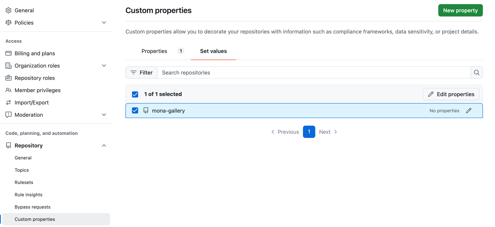
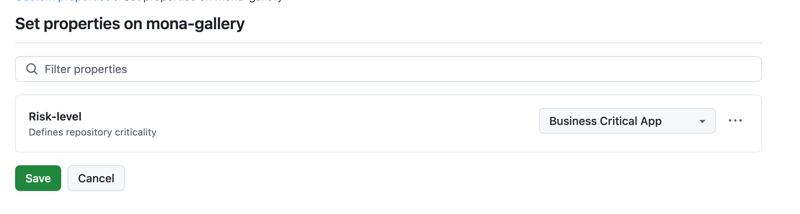

# Module 0 - GitHub Advanced Security: Organization-Level Setup

## Labs Overview
In this module, you’ll perform the initial setup of GitHub Advanced Security (GHAS) at the organization level by:
1. Reviewing pre-defined security configurations.
2. Creating a custom property for categorizing repositories.

---

### Lab 1 - Introduction to Security Configurations
#### Objective
Understand what organization‑level Security Configurations are, how to review and edit them, and explore the built‑in and predefined **GitHub Recommended** configuration.

#### Steps
1. In GitHub, navigate to your **Organization** `Settings`.
2. Within the **Security** group in the sidebar, click **Advanced Security** > **Configurations**.
3. Locate the **GitHub Recommended** policy and click **Edit**.
4. Review each section:
   - **GitHub Advanced Security Features**
   - **Secret scanning**
   - **Code scanning**
   - **Dependency graph & Dependabot**
   - **Policy**
5. Note the default settings (e.g., defaults for new repos, enforcement) and click **Cancel** to exit.

  
Need Help? View Screenshot

  
  

#### Discussion Points
- What advantages do pre-defined policies like **GitHub Recommended** offer?
- When might you override or customize these defaults?

---

### Lab 2 - Create a Custom Property for Repository Categorization
#### Objective
Define a custom repository property at the organization level to categorize repositories by risk.

#### Steps
1. In **Organization** settings, click **Repository** > **Custom properties**.
2. Click **New property**.
3. Enter:
   - **Name**: `Risk-level`
   - **Description**: `Defines repository criticality`
   - **Type**: `Single select`
   - **Options**: add `Business Critical App`, `Standard`, `Low Risk`.
4. Click **Save property**.
5. Navigate back to **Repository** > **Custom properties** and click the **Set values** tab.
6. Use the search to find the `mona-gallery` repository which will be our **Business Critical App**, check the box next to it, then click **Edit properties**.
7. Select **Risk-level** > **Business Critical App**, then **Save**.

  
Need Help? View Screenshot

  Defining a custom property:
  
  
  Applying a custom property:
  
  

#### Discussion Points
- How can risk categorization improve security prioritization?
- What other properties might help manage large portfolios?
- What are the potential impacts of not categorizing repositories effectively?
