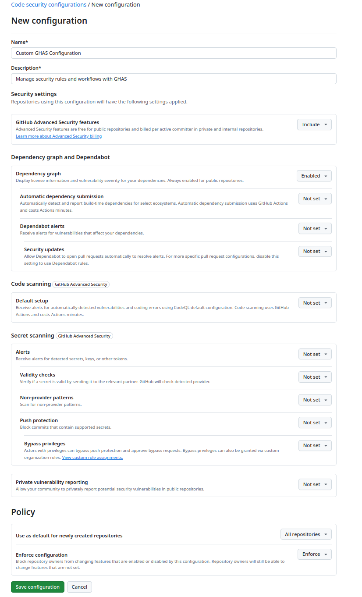

# Module 1 - Supply Chain Security

## Enablement  

### Lab 1 - Setting Up a Custom Security Configuration and Enabling Dependency Graph

#### Objective 
In this lab, you will learn how to create and apply a custom security configuration to repositories in your organization. 

#### Steps

1. Click on your Organization's settings. In the `Security` section of the sidebar, select the `Code security` dropdown menu, then click `Configurations`.  You will be navigated to the `Code security configurations` page, click `New configuration` button.
<details>
  <summary> Animated Guide</summary>


</details>

2. To help identify your custom security configuration and clarify its purpose, name your configuration and create a description. 

<details>
  <summary>Need Help? View Configuration Screenshot</summary>
  


</details>

3. For each configuration option select the following:
 - `GitHub Advanced Security Features`: Select `Include`.
 - `Dependency Graph`: Select `Enabled`.
 - All Other Settings: Select `Not set`.
 - In the `Policy` options, for `Use as default for newly created repositories`, select `All repositories`.
 - In the `Policy` options, for `Enforce Configuration`, select `Don't Enforce`.

4. Click on `Save Configuration` button. Please confirm save if prompted.

  <details>
 <summary>Need Help? View Configuration Screenshot</summary>  
   
   
   
 </details>

5. The page will redirected to the `Configurations` page. Click on the `Apply to` dropdown and select `All repositories`. There will be a prompt for confirmation, select `Apply`.
   
<details>
  <summary>Need Help? View Configuration Screenshot</summary>
  

</details>

## Supply Chain Security - Know Your Environment

### Lab 2 - Dependency Graph

#### Objective 

Understand how to navigate and interpret dependency graphs at both the organization and repository levels. Gain insights into the licenses used and the relationships between dependencies and dependents to ensure comprehensive dependency management.

#### Steps: Organization Level Dependencies 
1. On the Organization page, locate the `Insights` tab in the navigation bar at the top. Under the `Insights` sections, find and click on `Dependencies` from the left-hand menu. 
2. Review the licenses used in the Organization.
3. Explore the relationship between dependencies and dependents.
<details>
  <summary> Animated Guide</summary>


</details>

#### Steps: Repository Level Dependencies 
1. Navigate to the `mona-gallery` repository in your GitHub Organization.
1. On the repository page, locate the `Insights` tab in the navigation bar at the top. Under the `Insights` sections, find and click on `Dependency Graph` from the left-hand menu. 
2. Carefully review the list of dependencies displayed and verify completeness. Look for any missing dependencies.
<details>
  <summary> Animated Guide</summary>


</details>

#### Discussion Points 
- How do dependency relationships (dependencies vs. dependents) impact project maintenance and scalability?
- What tools or practices can be used to ensure dependency graphs remain accurate and up-to-date?

### Lab 3 - Dependency Submission API

#### Objective
In this lab, we'll learn how to use the Dependency Submission Action to correctly populate the dependency graph.

#### Steps
1. Navigate to the `moshi` repository in your GitHub Organization.
2. Notice that the dependency graph only shows 3 dependencies. This is unusual for a project of its size because the repository uses Gradle for its build process and Gradle resolves dependencies dynamically during build time.
3. Add the Dependency Submission Action. Fortunately, Gradle provides a GitHub Action that can generate and submit a dependency graph for Gradle projects.
  a. Navigate to the `.github/workflows` directory in your repository and create the `dependency-submission.yml` file.
  b. Copy and paste the following workflow into the file:

``` yaml

name: Dependency Submission

on:
  push:
    branches: [ 'master' ]
  pull_request:
    branches: ['master']

permissions:
  contents: write

jobs:
  dependency-submission:
    runs-on: ubuntu-latest
    steps:
    - name: Checkout sources
      uses: actions/checkout@v4
    - name: Configure JDK
      uses: actions/setup-java@v4
      with:
          distribution: 'zulu'
          java-version: '21'
          cache: 'gradle'

    - name: Generate and submit dependency graph
      uses: gradle/actions/dependency-submission@v4
```

4. Commit and push the changes to the repository.

  <details>
    <summary>Git Commands </summary>

  ```bash
  git add .github/workflows/dependency-submission.yml
  git commit -m "Add dependency submission workflow for Gradle"
  git push
  ```

  </details>

5. Ensure the workflow runs successfully. You can verify this in the `Actions` tab of the repository.
6. Once the workflow completes, navigate back to `Insights` > `Dependency graph`.
7. Confirm that the dependency graph now shows a complete and accurate list of dependencies.

#### Discussion Points
- Why is it important to have a complete and accurate dependency graph? How can incomplete graphs affect project security and maintenance?
- How does automating dependency submission improve workflow efficiency compared to manually tracking dependencies? Are there any drawbacks?
- How should your team incorporate reviewing and maintaining dependency graphs into their regular workflows?

### Lab 4 - Automatic Dependency Submission

#### Objective

In this lab, we'll learn how to use the built-in Automatic Dependency Submission feature to correctly populate the dependency graph. Instead of adding an Actions workflow as in the previous exercise, we will use the built-in feature to automatically submit dependency graphs for supported languages.

#### Steps
1. Navigate to the `mona-gallery` repository in your GitHub Organization.
2. Filter the dependencies by `ecosystem:Maven`.
3. Notice the dependency graph only shows 4 dependencies. This is unusual for a project of its size. 
4. Instead of adding an Actions workflow like in the previous exercises, we will use the built-in feature to automatically submit dependency graphs for supported languages. We can do this by enabling the `Automatic Dependency Submission` feature in the repository settings or better yet continue using the custom security configuration we created earlier.
5. Click on your organization's settings. In the `Security` section of the sidebar, select the `Advanced Security` dropdown menu, then click `Configurations`. Locate the custom configuration you created earlier to edit it.
6. Under the `Dependency scanning` section, navigate to the dropdown for `Automatic dependency submission` and set it to `Enabled`.
8. Navigate back to the `mona-gallery` repository and confirm that the changes made have been applied by looking at the `Settings` > `Code Security`. The `Automatic dependency submission` should be set to `Enabled`.
9. The automatic submission will occur on the first push to the pom.xml file after the option is enabled. Go ahead and make a small change to the `storage/pom.xml` file – you can add a comment or change the version of one of the dependencies.
10. Give it a minute for the workflow to finish before confirming that the dependency graph now shows a complete list of Maven dependencies, both direct and transitive.

#### Discussion Points
-  What are the advantages of using the built-in Automatic Dependency Submission feature over manually submitting dependency graphs?

### Lab 5 – Build Provenance, SBOM Generation, and Attestation

#### Objective 

You can use GitHub Actions to generate artifact attestations that establish build provenance for artifacts such as binaries and container images. This produces a cryptographically signed calims including information about the workflow, repository, organiszation, environment, commit SHA and other information associated with the OIDC token.  

A Software Bill of Materials (SBOM) is a comprehensive list of software components, dependencies, and versions within a project. Generating and attesting an SBOM improves supply chain security by enabling transparency about the software used and providing cryptographic proof of its integrity.

Methods to Retrieve SBOM:
- UI: You can download an SBOM directly via GitHub's UI under the Dependency graph or Security features.
- REST API: GitHub provides a REST API to retrieve SBOMs programmatically.
- GitHub Action: For automation, the SBOM Generator Action is a wrapper around the REST API and integrates directly into your workflows.

Together, SBOMs and build provenance provide:
- Transparency into both dependencies and build processes
- Traceability of artifacts back to their source and build environment
- Verification through attestations that prove authenticity and integrity

In this lab, we will use a GitHub Action to release, upload, and attest the SBOM.

#### Steps
1. Navigate to the `mona-gallery`repository in your organization.
2. Locate the workflow file named `release-attestation.yml` in the `.github/workflows` directory. Review the workflow below - what is it doing?

```yaml

name: Release with SBOM and Provenance attestation

on:
  push:
    tags:
      - 'v*'
env:
  REGISTRY: ghcr.io
  IMAGE_PREFIX: ghcr.io/${{ github.repository_owner }}

jobs:
  build:
    runs-on: ubuntu-latest
    permissions:
      contents: write
      packages: write
      attestations: write
      id-token: write
    
    strategy:
      matrix:
        service:
          - name: auth
            dockerfile: docker/auth.Dockerfile
            context: 
          - name: auth-ext
            dockerfile: docker/auth-ext.Dockerfile
            context: .
          - name: frontend
            dockerfile: docker/frontend.Dockerfile
            context: .
          - name: gallery
            dockerfile: docker/gallery.Dockerfile
            context: .
          - name: storage
            dockerfile: docker/storage.Dockerfile
            context: .
    
    steps:
      - name: Checkout repository
        uses: actions/checkout@v4

      - name: Set up Docker Buildx
        uses: docker/setup-buildx-action@v3

      - name: Log in to Container Registry
        uses: docker/login-action@v3
        with:
          registry: ${{ env.REGISTRY }}
          username: ${{ github.actor }}
          password: ${{ secrets.GITHUB_TOKEN }}

      - name: Extract metadata
        id: meta
        uses: docker/metadata-action@v5
        with:
          images: ${{ env.IMAGE_PREFIX }}/${{ matrix.service.name }}
          tags: |
            type=semver,pattern={{version}}
            type=semver,pattern={{major}}.{{minor}}
            type=semver,pattern={{major}}
            type=raw,value=latest,enable={{is_default_branch}}
            
      - name: Build and push Docker image
        id: push
        uses: docker/build-push-action@v5
        with:
          context: ${{ matrix.service.context }}
          file: ${{ matrix.service.dockerfile }}
          push: true
          tags: ${{ steps.meta.outputs.tags }}
          labels: ${{ steps.meta.outputs.labels }}
          platforms: linux/amd64
          cache-from: type=gha
          cache-to: type=gha,mode=max
          provenance: true
          sbom: true

```

4. Update the workflow to generate artifact attestation for each container.

      <details>
        <summary>Need Help? Here's a hint</summary>
           Use the `actions/attest-build-provenance@v3` after the release of each container. You can read about it here - https://github.com/actions/attest-build-provenance
      </details>
      
      
      <details>
        <summary> Solution </summary>
      
      ```yaml
            - name: Generate artifact attestation
              uses: actions/attest-build-provenance@v3
              with:
                subject-name: ${{ env.IMAGE_PREFIX }}/${{ matrix.service.name }}
                subject-digest: ${{ steps.push.outputs.digest }}
                push-to-registry: true
                github-token: ${{ secrets.GITHUB_TOKEN }}
      
      ```
      
      </details>

5. Update the workflow to generate an SBOM in `CycloneDX (cdx)` format

      <details>
        <summary>Need Help? Here's a hint</summary>
           Use the `uses: anchore/sbom-action@v0.20.5` after the artifact attestation step. You can read about it here - https://github.com/anchore/sbom-action
      </details>
      
      <details>
        <summary> Solution </summary>
      
      ```yaml
            - name: Generate SBOM for built image
              uses: anchore/sbom-action@v0.20.5
              with:
                image: ${{ env.IMAGE_PREFIX }}/${{ matrix.service.name }}@${{ steps.push.outputs.digest }}
                format: cyclonedx-json
                output-file: ${{ matrix.service.name }}-sbom.cdx.json
                upload-artifact: false
                upload-release-assets: false
      
      ```
      
      </details>


6. SBOM attestation ensures the integrity, authenticity, and trustworthiness of a Software Bill of Materials by proving it was generated from a secure and verified process. Update the workflow to use the `attest-sbom` action to create an attestation for our SBOM and upload it as an artifact using the `upload-artifact` action. 

      
      <details>
        <summary>Need Help? Here's a hint</summary>
           Use the `actions/attest-sbom@v3` after the release of each container. You can read about it here - https://github.com/actions/attest-sbom
           Use the `actions/upload-artifact@v4` to upload the action. You can read about it here - https://github.com/actions/upload-artifact
      </details>
      
      
      <details>
        <summary> Solution </summary>
      
      ```yaml
      
            - name: Attest SBOM
              uses: actions/attest-sbom@v3
              with:
                subject-name: ${{ env.IMAGE_PREFIX }}/${{ matrix.service.name }}
                subject-digest: ${{ steps.push.outputs.digest }}
                sbom-path: ${{ matrix.service.name }}-sbom.cdx.json
                push-to-registry: true
      
            - name: Upload SBOM artifact
              uses: actions/upload-artifact@v4
              with:
                name: ${{ matrix.service.name }}-sbom-${{ github.run_id }}
                path: ${{ matrix.service.name }}-sbom.cdx.json
      
      ```
      
      </details>


#### Discussion Points 
- Why is build provenance important for supply chain security?
- What types of attacks can provenance and SBOM attestation help prevent?
- How would you verify that the SBOM and provenance attestations are valid
- How do SBOMs differ from provenance metadata, and why do we need both?
- Why are SBOMs critical for supply chain security? How can they help organizations manage software vulnerabilities and risks?
- How does this workflow help meet compliance requirements?
- What risks remain even after implementing SBOMs and provenance?

## Supply Chain Security - Manage Your Environment

### Lab 6 - Dependabot Rules 

#### Objective
In this lab, we will configure Dependabot Rules to manage alerts in the `mona-gallery` repository. Since this repository is very active and the development team does not have time to remove or replace dependencies unless a patch is available, we will create a rule to dismiss alerts for the `Go` and `Pip` ecosystems when no patch exists.

#### Steps
1. Navigate to the `mona-gallery` repository. Click on the `Settings` tab, under `Security`, select `Code security and analysis`.
2. Scroll to the `Dependabot Rules` section and select the cog wheel icon to manage rules. Click on the `New Rule` green button.
3. Set Up the Rule:
- Rule Name: Dismiss No-Patch Alerts for Go and Pip.
- Target Alerts > Ecosystem: Select Go and Pip from the dropdown list.
- Rules : Select Dismiss alerts > Until patch is available
4. Select `Create Rule` button
5. Navigate to the Dependabot Alerts tab and view which alerts have been closed. 

#### Discussion Points
- What are the potential risks of dismissing alerts for unpatched vulnerabilities? How can these risks be mitigated?
- How should teams prioritize alerts that cannot be dismissed due to the presence of patches? What criteria should be used to decide on the urgency of addressing these vulnerabilities?
- How can teams effectively communicate the rationale for dismissing certain alerts to stakeholders, including management and security teams?

### Lab 7 - Depenabot Version Updates

#### Objective

In this exercise, we will create a Dependabot configuration file to automate version updates for npm dependencies in the frontend directory of the `mona-gallery` repository.

#### Steps

1. Inside the `.github` folder create a `dependabot.yml` file 
2. Add the following configuration (Note: you must first create the label for this workflow to work)

```yaml

version: 2
updates:
  # Keep npm dependencies up to date
  - package-ecosystem: "npm"
    directory: "/frontend"
    schedule:
      interval: "weekly"
    # Raise all npm pull requests with custom labels
    labels:
      - "dependabot-version-update"
    commit-message:
      prefix: "DEPENDABOT VERSION UPDATES"
    
```

3. Commit and push your changes 


<details>
    <summary>Git Commands </summary>

  ```bash
git add .github/dependabot/dependabot.yml
git commit -m "Add Dependabot configuration for npm updates"
git push origin main
  ```
  </details>

4. Navigate to the `Pull Requests` tab and review the generated pull requests. 

#### Discussion Points 
- What factors influence the decision to schedule updates weekly, daily, or monthly?
- How can you balance the frequency of updates with the workload of reviewing pull requests?
- Discuss managing dependency updates across multiple teams and projects.
- How can you test the configuration to ensure it is working as expected?
- What is the process for reviewing and merging Dependabot pull requests?
- How can you automate testing for these pull requests to ensure they don’t break your code?
- How do you handle deprecated or unmaintained dependencies

### Lab 8 - Dependency Review

#### Objective

In this lab, we will configure a Dependency Review workflow in GitHub Actions to analyze pull requests (PRs) and alert on the introduction of vulnerable dependencies to the `mona-gallery` repository.

#### Steps
1. Open your repository in Codespaces.
2. Create a new file named `dependency-review.yml` in the `.github/workflows` directory 
3. Add the following configuration file: 

```yaml

name: 'Dependency Review'
on: [pull_request]

permissions:
  contents: read
  pull-requests: write

jobs:
  dependency-review:
    runs-on: ubuntu-latest
    steps:
    - name: 'Checkout Repository'
      uses: actions/checkout@v4
    - name: Dependency Review
      uses: actions/dependency-review-action@v4
      with:
        # Possible values: "critical", "high", "moderate", "low"
        fail-on-severity: moderate       
        # You can only include one of these two options: `allow-licenses` and `deny-licenses`
        # ([String]). Only allow these licenses (optional)
        # Possible values: Any SPDX-compliant license identifiers or expressions from https://spdx.org/licenses/
        allow-licenses: GPL-3.0, BSD-3-Clause, MIT
        # ([String]). Block the pull request on these licenses (optional)
        # Possible values: Any SPDX-compliant license identifiers or expressions from https://spdx.org/licenses/
        #deny-licenses: LGPL-2.0, BSD-2-Clause
        comment-summary-in-pr: true
        # ([String]). Skip these GitHub Advisory Database IDs during detection (optional)
        # Possible values: Any valid GitHub Advisory Database ID from https://github.com/advisories
        allow-ghsas: GHSA-abcd-1234-5679, GHSA-efgh-1234-5679
        # ([String]). Block pull requests that introduce vulnerabilities in the scopes that match this list (optional)
        # Possible values: "development", "runtime", "unknown"
        fail-on-scopes: development, runtime
```
4. Commit and push your changes 

<details>
    <summary>Git Commands </summary>

```bash
git add .github/workflows/dependency-review.yml
git commit -m "Add Dependency Review workflow"
git push origin main
```
</details>

5. Create a branch from the `main` branch

<details>
    <summary>Git Commands </summary>

  ```bash
git checkout -b feature-a
git push origin feature-a
```
</details>

6. Open a terminal in Codespaces and run `npm install json-web-token`
7. Commit and push the code 

<details>
    <summary>Git Commands </summary>

 ```bash
git add .
git commit -m "added json-web-token dependency"
git push
```
</details>

8. Raise a Pull Request to the `main` branch

#### Discussion Points
- Why is it important to manage open-source licenses in addition to vulnerabilities?
- What steps can teams take to ensure compliance with allowed licenses?
- What strategies can be implemented to minimize friction during reviews?
- How do you balance security requirements with the need to avoid workflow bott

