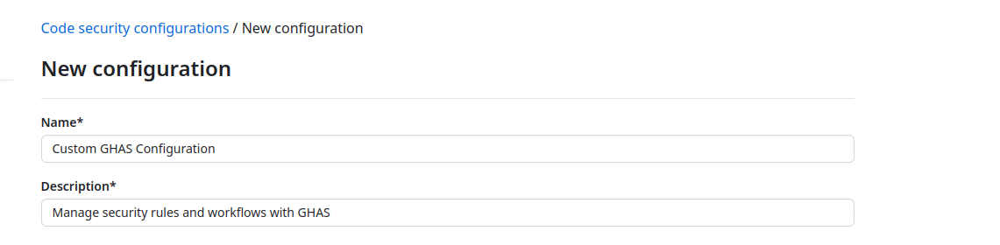
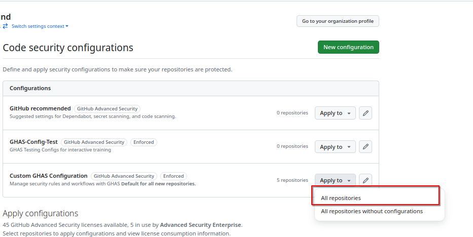
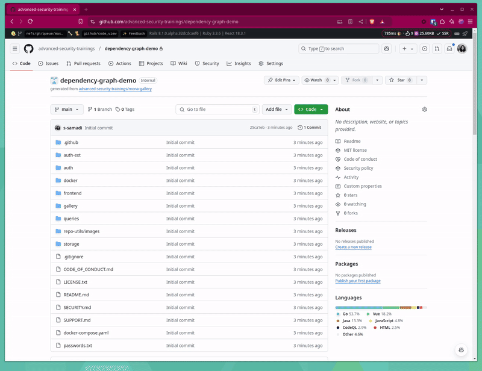

# Module 1 - Supply Chain Security

## Enablement  

### Lab 1 - Setting Up a Custom Security Configuration and Enabling Dependency Graph

In this lab, you will learn how to create and apply a custom security configuration to repositories in your organization. 

Follow the steps below to complete the exercise:

1. Click on your Organization's settings. In the `Security` section of the sidebar, select the `Code security` dropdown menu, then click `Configurations`.  You will be navigated to the `Code security configurations` page, click `New configuration` button.

  
 Animated Guide

2. To help identify your custom security configuration and clarify its purpose, name your configuration and create a description. 

  
Animated Guide

  

3. For each configuration option select the following:
 - `GitHub Advanced Security Features`: Select `Include`.
 - `Dependency Graph`: Select `Enabled`.
 - All Other Settings: Select `Not set`.
 - In the `Policy` options, for `Use as default for newly created repositories`, select `All repositories`.
 - In the `Policy` options, for `Enforce Configuration`, select `Enforce`.

4. Click on `Save Configuration` button. Please confirm save if prompted.

  

 
Need Help? View Configuration Screenshot
  
   
   
   
 

6. The page will redirected to the `Configurations` page. Click on the `Apply to` dropdown and select `All repositories`. There will be a prompt for confirmation, select `Apply`.
   

  
Animated Guide

  
**TO DO: GIF THIS WHEN TOTAL NUMBER OF REPOS CONFIRMED**

## Supply Chain Security - Know Your Environment

### Lab 2 - Dependency Graph

#### Exercise: Organization Level Dependencies 
1. On the Organization page, locate the `Insights` tab in the navigation bar at the top. Under the `Insights` sections, find and click on `Dependencies` from the left-hand menu. 
2. Review the licences used in the Organization.
3. Explore the relationship between dependencies and dependents.

#### Exercise: Repository Level Dependencies 
1. On the repository page, locate the `Insights` tab in the navigation bar at the top. Under the `Insights` sections, find and click on `Dependency Graph` from the left-hand menu. 
2. Carefully review the list of dependencies displayed and verify completeness. Look for any missing dependencies.

### Lab - Dependency Submission API 

